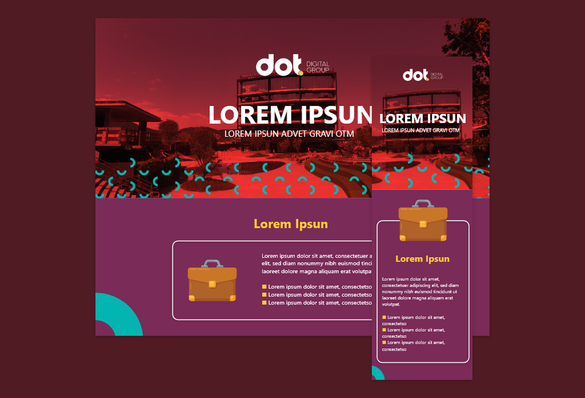

#  **Teste Técnico - DOT Digital Group**

## 	&#127919; **About**
Teste técnico para desenvolver uma aplicação front end sem o uso de frameworks e responsiva 

 

## 🔧 **Techs** 🔧

HTML 
CSS 
JavaScript 

## **Objetivo**
Desenvolver o front-end do mockup do Adobe XD fornecido.

## **Pontos que serão analisados:**
● A página deve ficar igual ou o mais próxima possível do mockup fornecido; 
● A página deve ser responsiva e ter uma boa visualização em telas com largura
de 1920px à 360px; 
● A página deve funcionar na última e penúltima versão dos principais
navegadores; 
● O código deve estar semanticamente correto, bem organizado e estruturado. 
● A estrutura dos arquivos e pastas deve estar bem organizada. 
● Os recursos interativos devem funcionar adequadamente. São eles: 
  o Dropdown 
  o Círculo interativo (está explicado melhor abaixo) 

## **Funcionamento esperado do recurso Dropdown:**
● Ao clicar sobre o botão com a seta para baixo de um item, o box de conteúdo
referente ao item deve ser aberto. 
● Ao clicar sobre o botão com a seta para cima de um item já aberto, o box de
conteúdo deverá ser fechado. 
● Apenas o item que teve o botão clicado deve sofrer as interatividades citadas
acima. 

## **Funcionamento esperado do recurso Círculo interativo:**
● Ao clicar no botão (+) que está sobre a flecha amarela, a cor de fundo do círculo
central deve ser alterada para #FFCC33, a cor de texto para #000 e a seguinte
mensagem de texto deve ser exibida: “Texto com fundo amarelo!”. 
● Ao clicar no botão (+) que está sobre a flecha cinza, a cor de fundo do círculo
central deve ser alterada para #707070, a cor de texto para #FFF e a seguinte
mensagem de texto deve ser exibida: “Texto com fundo cinza!”. 

● Ao clicar no botão (+) que está sobre a flecha vermelha, a cor de fundo do
círculo central deve ser alterada para #FF3737, a cor de texto para #FFF e a
seguinte mensagem de texto deve ser exibida: “Texto com fundo vermelho!”. 
● Todos os três textos devem ser inseridos no código HTML, 

 